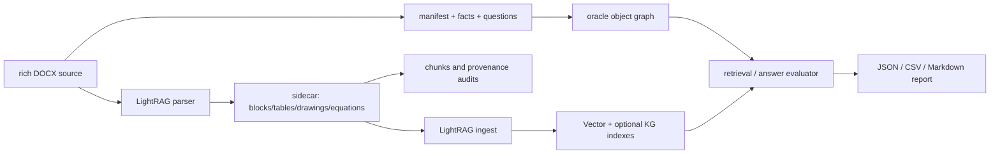

# LightRAG 富文本文档 Memory 评估框架

本目录提供一套可复现的评估基线，用于回答一个具体问题：对于一份超长、富文本、单文档，LightRAG 能否把它可靠地转化为可检索、可追溯、可用于问答的知识表示。

框架刻意拆成两个独立部分：`memory_data_service/` 负责生成或托管带真值的文档；`memory_eval_tests/` 只读取这些数据，并审计解析、表示、索引、检索、问答与性能。测试框架本身不生成文档，避免“出题器”和“阅卷器”相互耦合。

## 1. 范围与结论边界

这不是通用 RAG 排行榜，也不是对模型知识能力的测试。它针对单一复杂技术文档，重点衡量：

- 文本、表格、图片、caption、公式、脚注、交叉引用、双栏、文本框等内容是否被保留。
- 文档对象是否仍能追溯到 parser block、sidecar 引用和 chunk。
- 检索是否找回 oracle 指定的证据，而不仅是语义相近的片段。
- 回答是否正确、是否基于证据、是否能在没有证据时拒答。
- 开启 KG 后，召回提升是否伴随上下文噪声、近邻事实混淆或回答退化。

当前 `rich` 数据集是一个具有可控真值的 synthetic benchmark。它适合定位解析和检索链路的故障，但不等价于真实论文、扫描 PDF、企业白皮书的全部版面分布。真实文档集、Docling/MinerU PDF 路径与细粒度 citation 仍应作为下一阶段补充。

## 2. 目录与数据流

```text
memory_data_service/                 # 独立数据生成/托管服务
  generators/                        # DOCX 与 rich DOCX 生成器
  generated/<dataset_id>/            # 本地产物，已忽略，不提交
  app.py / cli.py / storage.py       # FastAPI 传输、CLI 与持久化
  schemas.py                         # manifest/oracle 数据模型（含 schema_version）

memory_eval_tests/                   # 评估消费者，不生成文档
  common/                            # DatasetClient、确定性抽样、证据归一化、HTTP 认证助手
  offline/                           # 完整性、parser、版面、追溯和性能审计
  online/                            # API 预检、导入、检索与回答评测
  experiments/                       # 14 个注册实验 + 统一 harness 与 supervise 看护
  reporting/                         # 单次、对比、规模、就绪度与 baseline 回归报告
  runs/                              # 评估产物，已忽略，不提交、不移动

lightrag/api/                        # 评测工作台后端
  eval_routes.py / eval_index.py     # console 只读接口 + 运行/数据集/模板/job 接口
  eval_jobs.py                       # 文件化作业管理器（run/dataset job、PID 安全取消）

memory_eval_tests/runs/EXPERIMENT_RESULTS_SUMMARY.md  # 已验证实验结论与产物索引
memory_eval_env.yml                   # 推荐 Conda 环境定义
```

所有入口均位于职责化子包中（`offline/ online/ experiments/ reporting/`），
不再保留顶层兼容入口；新脚本一律使用分组后的模块路径。



## 3. 环境

所有命令在仓库根目录 `/Users/sakura/RAG/LightRAG` 执行，并使用独立环境 `lightrag-memory-eval`。项目本地的 `.env` 用于 LightRAG API、Ollama 和外部 LLM 配置；它被 git 忽略，不能提交 API Key。

首次创建环境：

```bash
/Users/sakura/miniconda3/bin/conda env create -f memory_eval_env.yml
```

已经存在时，建议统一以 `conda run` 执行：

```bash
/Users/sakura/miniconda3/bin/conda run -n lightrag-memory-eval python --version
```

`memory_eval_env.yml` 使用 editable install 安装当前工作树的 LightRAG，因此对 `lightrag/` 的本地修改会直接生效。

关键环境变量：

| 变量 | 作用 |
| --- | --- |
| `MEMORY_EVAL_DATASETS_ROOT` | 数据集生成与读取根目录；**打包安装（wheel）后必设**，因为 site-packages 内的默认目录通常只读 |
| `MEMORY_EVAL_RUNS_ROOT` | runs 根目录；envelope 索引失效与 console 扫描同源 |
| `LIGHTRAG_API_KEY` / `LIGHTRAG_ACCESS_TOKEN` | 在线评测 CLI/API 的 `X-API-Key` / Bearer 认证；envelope 落盘时自动脱敏为 `configured` |
| `MEMORY_DATA_SERVICE_API_KEY` | 独立数据集服务（可选）的 `X-API-Key` 门控 |
| `OLLAMA_URL` / `OLLAMA_MODEL` | console “AI 分析”使用的服务端模型端点与模型名 |

`/eval` 路由依赖随 wheel 一起打包的 `memory_eval_tests` / `memory_data_service`
包；如果包缺失（例如手工裁剪安装），`/eval` 会返回 503 并在 status 中报告框架版本。

## 4. 数据生成服务

### 4.1 数据集层级

| tier | 默认页数 | 用途 |
| --- | ---: | --- |
| `smoke` | 20 | 开发、解析与端到端冒烟测试 |
| `medium` | 200 | 常规检索与索引评估 |
| `large` | 1000 | 超长单文档评估 |
| `stress` | 3000 | 资源和稳定性压力测试 |

可使用 `--pages` 覆盖页数。默认设置了 3000 页保护阈值；超过该阈值必须显式加 `--allow-oversized-generation`，因为 DOCX 在 Python 进程中写入，内存与耗时会显著增加。

### 4.2 生成 rich 文档

```bash
DATASET_ROOT=memory_data_service/generated
/Users/sakura/miniconda3/bin/conda run -n lightrag-memory-eval \
  python -m memory_data_service.cli generate \
  --profile rich --tier smoke --formats docx \
  --dataset-id rich-smoke-v1 --output-root "$DATASET_ROOT"
```

`--profile rich` 是默认配置。生成的 DOCX 包含多级标题、目录字段、页眉页脚、编号与嵌套列表、合并表头和跨页长表格、含文字/数值的图片、caption、OMML 公式、脚注与尾注、REF/bookmark 交叉引用、CITATION/BIBLIOGRAPHY 字段、双栏 section、VML 浮动文本框、术语表、附录及干扰事实。

需要较小的旧式样本时使用 `--profile basic`。可限制或声明模态：

```bash
/Users/sakura/miniconda3/bin/conda run -n lightrag-memory-eval \
  python -m memory_data_service.cli generate \
  --profile rich --pages 200 --formats docx \
  --modalities text,tables,figures,equations
```

PDF 是由本机 LibreOffice `soffice --headless` 从 DOCX 转换。若工具未安装、崩溃或转换失败，生成仍成功，但 `manifest.json` 将该格式标记为 `skipped`。这不是 DOCX 或 oracle 的失败；不要把跳过的 PDF 当作已完成 PDF parser 测试。

### 4.3 数据集产物与 oracle

每个数据集目录的核心文件如下：

| 文件 | 作用 |
| --- | --- |
| `<dataset_id>.docx` / `.pdf` | 被测文档 |
| `manifest.json` | 页数、格式、模态、文件状态、生成资源信息 |
| `facts.json` | 原子事实与标准答案 |
| `questions.json` | 问题、答案、问题类型、证据事实 ID |
| `objects.json` | document/section/paragraph/table/figure/equation/caption 等对象 |
| `relations.json` | contains、caption_of、refers_to、supports、contradicts 等关系 |
| `oracle.json` | 以上真值的统一入口 |
| `FIG-*.png` | 图像对象资产 |

`facts` 是可验证的知识单元，`questions` 将每个问题绑定到一个或多个 `evidence_fact_ids`，`objects/relations` 组成生成阶段的 oracle document graph。评估时，LightRAG 的 parser sidecar、chunk、API 返回内容必须与这些真值对应，不能只凭回答看似合理。

检查本地已有数据集：

```bash
/Users/sakura/miniconda3/bin/conda run -n lightrag-memory-eval \
  python -m memory_data_service.cli list
```

### 4.4 FastAPI 服务

CLI 生成默认**拒绝覆盖已存在**的 dataset_id，需要显式 `--force`；`--output-root`
可指定数据集根目录（也受 `MEMORY_EVAL_DATASETS_ROOT` 影响）。

```bash
/Users/sakura/miniconda3/bin/conda run -n lightrag-memory-eval \
  python -m memory_data_service.cli serve --host 127.0.0.1 --port 9731
```

接口为：

| 方法 | 路径 | 作用 |
| --- | --- | --- |
| `POST` | `/datasets?force=` | 根据请求生成数据集（force 覆盖已存在项） |
| `GET` | `/datasets?limit=&offset=` | 分页列出数据集 |
| `GET` | `/datasets/{dataset_id}` | 获取 manifest |
| `GET` | `/datasets/{dataset_id}/oracle` | 获取统一 oracle |
| `GET` | `/datasets/{dataset_id}/files/{name}` | 下载 DOCX/PDF/JSON/图片 |
| `DELETE` | `/datasets/{dataset_id}` | 删除数据集（路径校验；评测工作台代理的删除在生成中返回 409） |

测试可将本地目录替换为服务返回的 manifest URL；离线大规模评估更适合直接访问本地目录，以避免传输成本。
设置 `MEMORY_DATA_SERVICE_API_KEY` 后，所有接口要求 `X-API-Key` 头。

> 评测工作台（`/eval/datasets`）直接代理以上能力（分页列表、表单化生成、删除），
> 通常不需要单独启动本服务。

## 5. 离线测试：先验证表示与可追溯性

离线阶段不依赖 LLM、Embedding 或 LightRAG API。它验证“文档有没有被正确读入、对象是否仍能被定位、chunk 是否丢失证据”。这是在线问答前的必要前置条件。

先做完整性检查：

```bash
DATASET=memory_data_service/generated/rich-smoke-v1
/Users/sakura/miniconda3/bin/conda run -n lightrag-memory-eval \
  python -m memory_eval_tests.offline.integrity "$DATASET" --json
```

一键运行完整离线套件：

```bash
/Users/sakura/miniconda3/bin/conda run -n lightrag-memory-eval \
  python -m memory_eval_tests.offline.offline_runner \
  --dataset "$DATASET" --engine native --top-k 5 --force-reparse --json
```

产物默认写入 `memory_eval_tests/runs/offline/<dataset_id>/`。大文档建议使用固定上限抽样，保持结果可复现并控制运行时间：

```bash
/Users/sakura/miniconda3/bin/conda run -n lightrag-memory-eval \
  python -m memory_eval_tests.offline.offline_runner \
  --dataset "$DATASET" --engine native --top-k 5 \
  --max-cases 500 --max-facts 1000
```

离线套件包含：

| 检查 | 回答的问题 |
| --- | --- |
| `integrity` | manifest、facts、questions、objects、relations 是否自洽 |
| `sidecar_audit` | parser 是否产出 blocks、tables、drawings、equations 及有效 refs/assets |
| `layout_audit` | 位置字段覆盖率、对象是否链接到 positioned block、复杂版面文本是否保留 |
| `object_traceability` | table/figure/equation/caption 是否能回到 block 与 chunk |
| `chunk_traceability` | 每个 chunk 是否带 sidecar refs，事实/引用是否仍可命中 |
| `cross_reference_audit` | Word REF/bookmark 与 oracle `refers_to` 关系是否保留 |
| `retrieval_eval --backend sidecar` | 词法 sidecar baseline 是否能找回 oracle 证据 |
| `performance_audit` | 生成/解析耗时、文件体积、blocks/objects/chunks 数量 |

注意：native DOCX parser 的 `position` 目前通常是 `paraid` 占位，缺少稳定页码和 bbox。因此 `position_coverage=1.0` 只说明有位置占位，不代表可做页面级定位。当前严格审计已发现 VML floating textbox 文本未被 native parser 保留；离线总结果显示 `passed=false` 时，应先阅读具体 audit，而不应把它理解成框架崩溃。

## 6. 在线测试：索引、检索与回答

在线阶段增加三类后端：生成 LLM、Embedding、可选 VLM。建议先使用本地 Ollama Embedding，减少 API 成本；LLM 可使用项目根目录 `.env` 中的 Ollama 或 OpenAI-compatible 配置。不要把 key 写进 README、命令历史或 git。

### 6.1 启动前检查

```bash
/Users/sakura/miniconda3/bin/conda run -n lightrag-memory-eval \
  python -m memory_eval_tests.online.api_preflight \
  --rag-api-url http://127.0.0.1:9621 \
  --ollama-url http://127.0.0.1:11434 \
  --output memory_eval_tests/runs/api_preflight.json
```

启动 LightRAG API 的例子（具体模型、超时与 parser 以项目 `.env` 为准）：

```bash
NO_PROXY=127.0.0.1,localhost \
/Users/sakura/miniconda3/bin/conda run -n lightrag-memory-eval lightrag-server \
  --host 127.0.0.1 --port 9621 --timeout 900 --max-async 1 \
  --llm-binding ollama --embedding-binding ollama --rerank-binding null
```

`qwen3` 使用 Ollama 时建议设置 `OLLAMA_LLM_THINK=false`。本工作树已修复将该选项从 `options.think` 正确提升到 Ollama API 顶层参数的兼容问题，避免 reasoning-only 响应造成空答案。

### 6.2 导入与评估

```bash
# 导入文档并等待索引完成
/Users/sakura/miniconda3/bin/conda run -n lightrag-memory-eval \
  python -m memory_eval_tests.online.index_runner \
  --dataset "$DATASET" --rag-api-url http://127.0.0.1:9621 \
  --formats docx --wait --timeout-seconds 5400 --poll-seconds 15

# 评估检索证据
/Users/sakura/miniconda3/bin/conda run -n lightrag-memory-eval \
  python -m memory_eval_tests.online.retrieval_eval \
  --backend api --dataset "$DATASET" --rag-api-url http://127.0.0.1:9621 \
  --mode mix --top-k 5 \
  --output memory_eval_tests/runs/online/<run-id>/retrieval_mix_top5.json

# 评估最终回答与引用
/Users/sakura/miniconda3/bin/conda run -n lightrag-memory-eval \
  python -m memory_eval_tests.online.answer_eval \
  --dataset "$DATASET" --rag-api-url http://127.0.0.1:9621 \
  --mode mix --top-k 5 --chunk-top-k 5 --max-total-tokens 8192 \
  --output memory_eval_tests/runs/online/<run-id>/answer_mix_top5.json

# 汇总成可读报告
/Users/sakura/miniconda3/bin/conda run -n lightrag-memory-eval \
  python -m memory_eval_tests.reporting.report \
  memory_eval_tests/runs/online/<run-id>/retrieval_mix_top5.json \
  memory_eval_tests/runs/online/<run-id>/answer_mix_top5.json \
  --format markdown --output memory_eval_tests/runs/online/<run-id>/online_report.md
```

`docx:native-iteP!` 代表跳过 KG；`docx:native-iteP` 代表正常 KG extraction。两者必须使用隔离的 `WORKING_DIR`，否则历史缓存、chunk 或图谱会污染对照实验。

如果 LightRAG API 开启了认证，在线评测 CLI 需要显式传认证参数：

```bash
... --rag-api-url http://127.0.0.1:9621 \
    --api-key "$LIGHTRAG_API_KEY" \
    --access-token "$LIGHTRAG_ACCESS_TOKEN"
```

`api_preflight` / `index_runner` / `retrieval_eval` / `answer_eval` 均支持
`--api-key` / `--access-token`，默认回退到同名环境变量。

### 6.3 指标的直白含义

| 指标 | 简单解释 |
| --- | --- |
| Evidence Recall@K | 前 K 个返回证据中，是否包含 oracle 要求的证据；越高越好 |
| MRR | 第一个正确证据排得是否靠前；越高说明越早找到 |
| Context Precision | 返回上下文中真正有用证据的比例；低值常意味着噪声多 |
| Object Hit Rate | 表/图/公式等目标对象是否被检索命中 |
| Answer Accuracy | 最终答案是否与 oracle 正确答案匹配 |
| Groundedness | 回答是否能由返回证据支持 |
| Ungrounded Rate（原 Hallucination Rate） | 答案错误或证据未进入上下文的回答占比（确定性评分）；不判定真实幻觉内容 |
| Abstention Accuracy | 文档没有答案时，是否明确且正确地拒答 |
| Evidence Available（原 Citation Accuracy） | oracle 证据是否出现在 API references 中；不等价于回答正确引用 |
| Citation Presence / Correctness | 回答是否出现显式稳定 ID 引用；正确性仅在有 ID 引用时定义 |

指标口径的权威定义见 `memory_eval_tests/README.md` 的“指标定义”一节；本文件保留历史语义说明。

## 7. 评测工作台与任务编排

评测框架已与 LightRAG API 集成：启动 `lightrag-server` 后，WebUI 的
**Evaluation** 标签页提供三个子视图：

- **运行**：runs 列表/详情（指标、逐题、报告、日志）、对比与 CSV 导出、
  活跃运行取消、一键复现。
- **新建运行**：选数据集 → 选实验（显示看护/续跑能力与
  `env_ready` 就绪状态）→ 填参数（通用字段 + 实验 `extra_schema` 高级参数）
  → 启动（可选看护）。
- **数据集**：列表（tier/页数/模态/文件数）、表单化生成（含资源预估与
  pages 上限提示）、删除（生成中返回 409）。

后端接口（均走 `combined_auth`）：

| 方法 | 路径 | 作用 |
| --- | --- | --- |
| `GET` | `/eval/experiments` | 14 个注册实验的元数据（supervision/supports_resume/extra_schema/env_ready） |
| `POST` | `/eval/jobs` | 启动作业：`kind=run`（运行实验）或 `kind=dataset`（生成数据集） |
| `GET` | `/eval/jobs` | 列出作业（文件化状态） |
| `GET` | `/eval/jobs/{id}` | 作业详情 + run.log tail |
| `POST` | `/eval/jobs/{id}/cancel` | 取消（killpg 整棵进程树；supervise 场景不会自动重启） |
| `GET/DELETE` | `/eval/datasets` | 数据集列表/删除（生成中 409）；**生成走 `POST /eval/jobs`（`kind=dataset`）** |
| `GET/POST/DELETE` | `/eval/templates` | 运行模板 CRUD（name sanitize + 原子写） |

作业权威状态为 `runs/.jobs/<job_id>/job.json`（顶层 pid + 进程启动时间 +
退出码），活跃判定基于存活探测，API 重启后取消仍可恢复；job.json **不存凭据**。
run 参数白名单拒绝基础设施键（`rag_api_url` / `ollama_url` / `storage_dir` /
`api_key` / `access_token`），缺少 `env_required` 环境变量的实验返回 400。
数据集生成默认 pages 上限 1000，`allow_oversized_generation` 可放开。

> 并发与队列：作业按 FIFO 排队，`MEMORY_EVAL_MAX_ACTIVE_JOBS`（默认 1）控制
> 同时运行数，`MEMORY_EVAL_WAIT_FOR_RUN=<run_id>` 可让队列等待指定 run 完成后
> 再自动启动。后端队列已实现，前端“作业/队列视图”尚未提供（当前只能通过
> 运行列表间接看到已产出 envelope 的 run）。

## 8. 长实验看护（supervise）

`memory_eval_tests/experiments/supervise.py` 可看护长实验：子进程崩溃自动重启
（`supports_resume` 的实验自动读 `partial.json` 续跑），超过 `--max-restarts`
后放弃。**挂死检测默认关闭**，`--supervision heartbeat` 为显式高级选项。
子进程以独立会话运行，取消/信号覆盖整棵进程树（含子进程再 spawn 的孙进程）；
重启计数与原始 `started_at` 写入 envelope，console 徽标显示
“已重启 N 次”与最后一次是续跑还是从头重试。完整语义、阈值估算与 launchctl
示例见 `memory_eval_tests/README.md` 的“看护运行（supervise）”一节。

## 9. 两个当前优先实验

### A. 固定 KG Context，仅更换生成 LLM

目的：区分“KG 上下文组织有问题”和“本地 8B 模型读懂上下文的能力不足”。

正确做法是先从同一个已完成 KG 索引中导出每道题的检索结果，然后将完全相同的 context 与 prompt 分别发给 `qwen3:8b` 和外部 API LLM。不可重新检索，否则 query keyword 生成变化会让 context 不再固定。

该 runner 已实现并注册为实验 `frozen_prompt_llm_eval`：需要环境变量
`LIGHTRAG_PROJECT_OPENAI_API_KEY`，并通过 `--extra base_url=... prompts=...`
指定兼容端点与冻结 prompt 文件。WebUI 向导会根据 `env_ready` 自动禁用
未配置环境变量的实验。

记录：`answer_accuracy`、`groundedness`、`ungrounded_rate`、`abstention_accuracy`、`evidence_available`，并保存每题的 context hash，证明输入一致。

### B. KG Top-K / Context Size 消融

固定 `qwen3:8b`、同一 KG 索引、同一问题顺序与 prompt，依次运行 `top-k=1,3,5,10,20`。每个 Top-K 分别记录：

```text
Evidence Recall@K + Context Precision + Answer Accuracy
Groundedness + Ungrounded Rate + Query latency
```

若 Recall 在较小 K 已达饱和而 Accuracy 随 K 增大下降，说明更多召回结果稀释了关键证据，存在 context dilution；后续优先考虑 reranker、evidence selector 或结构化对象过滤，而不是盲目扩大 context。

## 10. 已知限制与下一步

- PDF 生成依赖本机 LibreOffice；当前环境曾出现 `soffice` 崩溃，必须修复后才能把 PDF parser 结论视为有效。
- native DOCX parser 对 VML 浮动文本框存在文本丢失，且未输出页码/bbox；它目前不满足强页面级可溯源要求。
- 当前 citation 指标主要验证来源文件，尚未验证 page/block/object 级 citation 的精确性。
- `rich` synthetic 数据具有 oracle，但真实世界文档集仍需单独建设，特别是扫描件、复杂图表、嵌套/断页表格和真实引用格式。
- Docling/MinerU 需要相应服务环境、模型与 PDF 输入；它们尚未纳入稳定基线。
- 1000/3000 页在线端到端实验会显著放大 KG extraction 时间与存储成本，应先在 smoke/medium 完成配置与消融，再进入长文档。
- 作业管理器为**进程内、单机**语义：活跃作业基于 `runs/.jobs` 文件推导，API
  重启可恢复取消，但不支持跨机器调度；并发启动多个 job 无硬限制
  （`MEMORY_EVAL_MAX_ACTIVE_JOBS` 未实现）。
- 控制台 i18n 已覆盖 11 种语言；`caseFieldLabel` 等少量逐题字段标签仍只提供
  zh/en 两种映射（其余语言回落 en）。
- 路线图下一阶段：失败模式自动聚类、回归仪表盘（跨 run 显著性对比）、报告
  导出 PDF/链接、真实文档集 + 人工标注、LLM-as-judge 复核与 page/block 级
  citation 粒度。

已验证实验结论、历史数值、当前瓶颈与下一阶段建议请查看 [实验结果汇总](memory_eval_tests/runs/EXPERIMENT_RESULTS_SUMMARY.md)。
