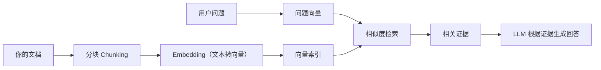
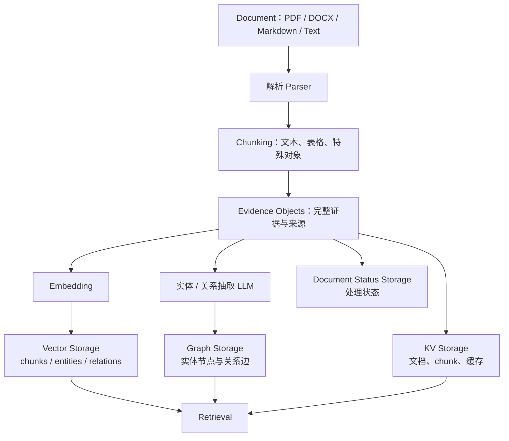
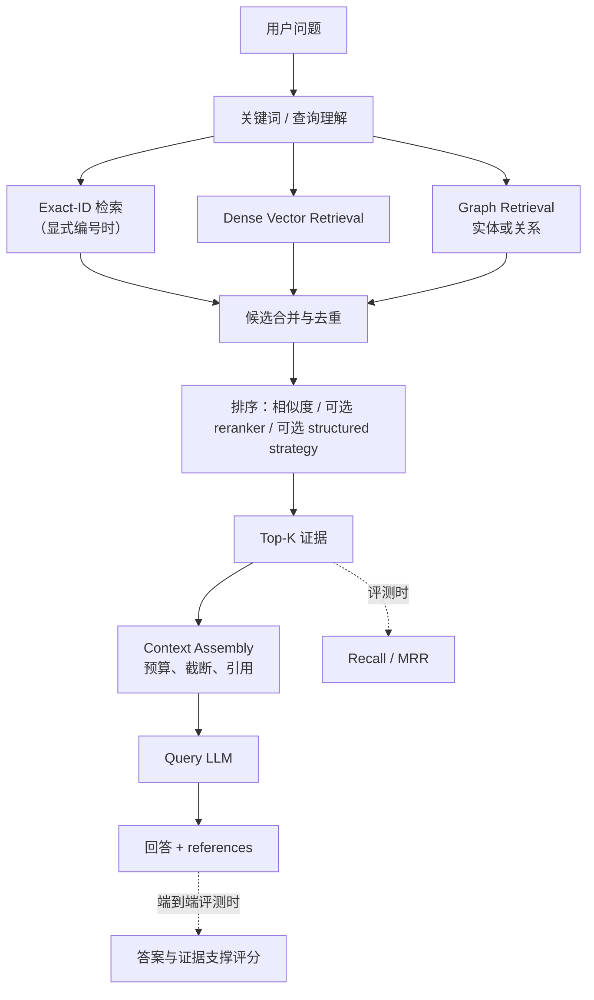
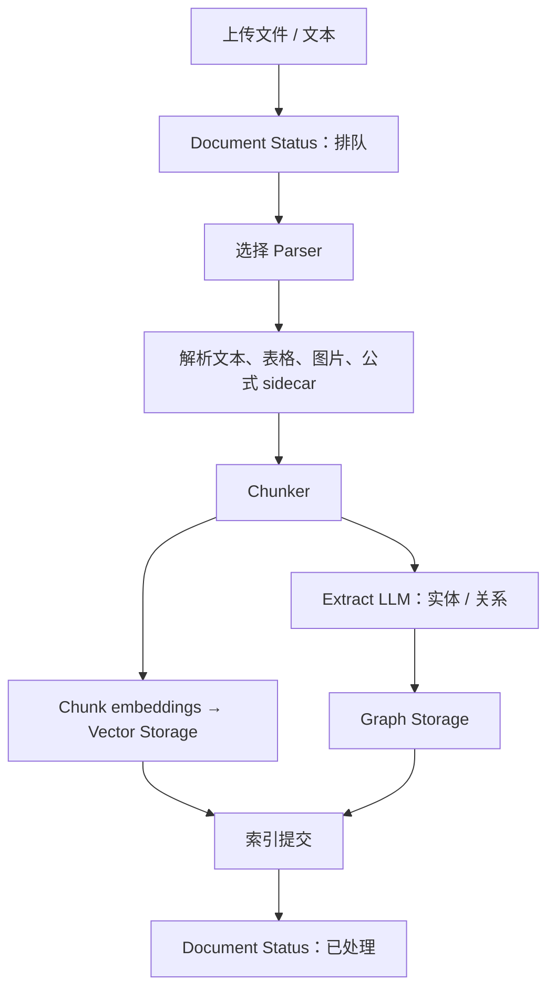
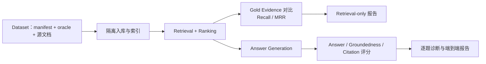

# LightRAG：从零开始的图谱增强 RAG 入门与实践

> 本 README 以**当前仓库**的代码、配置和脚本为准，而非其他版本的 LightRAG 教程。它既介绍 LightRAG 的核心能力，也标明本仓库新增的表格检索、显式编号召回、结构化排序和评测能力。

LightRAG 是一个用于“让大模型可靠地使用你的文档”的 RAG（Retrieval-Augmented Generation，检索增强生成）系统。它把文档切成可检索的内容，为内容建立向量索引和知识图谱；用户提问时先找证据、再组织上下文、最后由大语言模型生成回答。

如果你只想尽快跑起来，请直接阅读：[十分钟跑通](#十分钟跑通一次文档问答) → [上传文档并提问](#第一次上传文档并提问)。如果你还不熟悉 RAG，请从下一节开始按顺序阅读。

## 目录

- [LightRAG 要解决什么问题](#lightrag-要解决什么问题)
- [RAG 基础概念](#rag-基础概念)
- [整体架构与一次完整 Trace](#整体架构与一次完整-trace)
- [核心能力与本仓库扩展](#核心能力与本仓库扩展)
- [环境与部署](#环境与部署)
- [模型与存储配置](#模型与存储配置)
- [第一次上传文档并提问](#第一次上传文档并提问)
- [文档入库、分块、图谱与检索机制](#文档如何进入系统)
- [WebUI、API 与 Python SDK](#使用界面-api-与-python-sdk)
- [Evaluation 与 Recall Evaluation](#评测-evaluation-与-recall-evaluation)
- [研究实验、排障和扩展](#研究实验排障与扩展)

## LightRAG 要解决什么问题

普通大语言模型（LLM）回答问题时，主要依赖训练时已经见过的知识：

```text
用户问题
   ↓
LLM
   ↓
回答
```

这在问通用知识时很方便，但面对公司制度、论文、项目文档、实验记录或刚更新的数据时会有四个问题：模型不知道你的私有文件；它的内置知识可能过时；它会在没有依据时编造看似合理的内容（幻觉）；即使把整份长文放进提示词，也会受到上下文长度和成本限制。

最基础的 RAG 改变了回答路径：



这里的关键不是“让向量数据库回答问题”，而是让它找到尽可能相关的证据，再让 LLM 阅读这些证据并组织语言。LightRAG 在此基础上增加了知识图谱（Knowledge Graph，KG）：它从文本中提取实体及关系，因此除了“哪段话和问题语义相似”，还可以利用“谁和谁有关、关系是什么”来组织上下文。

当前仓库的默认 `mix` 模式会同时使用图谱相关证据和文本向量证据。它不是准确性保证：检索得到证据并不意味着模型一定会正确理解或引用证据，所以仓库还提供独立的检索与端到端评测。

## RAG 基础概念

下面的术语会在后文反复出现。先建立直觉，比一开始记缩写更重要。

| 概念 | 直觉与例子 | 在 LightRAG 中的作用 |
| --- | --- | --- |
| 文档（Document） | 一份 PDF、DOCX、Markdown、文本，或一段通过 API 写入的文字。 | 入库的原始来源，保留处理状态和来源路径。 |
| Token | 模型读写文本的计量单位，不等于“字”或“词”。 | 决定分块长度、上下文预算和模型成本。 |
| Chunk（分块） | 把长文切成较小、可独立检索的片段。例如“第 3 节的部署要求”。 | 向量检索和证据引用的基本单位。 |
| Embedding（嵌入） | 把“LightRAG 支持 PostgreSQL”转为一串数字。语义相近的句子得到相近的数字。 | 用于判断问题与哪些 chunk、实体或关系更相似；它不直接生成答案。 |
| Vector Database（向量存储） | 能快速找出“与问题向量距离最近”的内容的索引。 | 保存 chunk、实体和关系的向量，并执行相似度搜索。 |
| Entity（实体） | 文本中的关键对象，如 `OpenAI`、`GPT`、`PostgreSQL`。 | 图谱中的节点。 |
| Relation（关系） | 两个实体之间的有意义连接，如 `OpenAI --developed--> GPT`。 | 图谱中的边，适合关系与全局问题。 |
| Knowledge Graph（知识图谱） | 由节点和边构成的网络。 | 补充纯向量检索的结构信息。 |
| Retrieval（检索） | 从大量候选里找可能有用的证据。 | 目标是“不要漏掉关键证据”。 |
| Ranking / Reranking（排序 / 重排） | 检索先给候选，排序再决定谁更靠前。 | 降低噪声，使有限的上下文优先容纳更有用的证据。 |
| Context（上下文） | 最终放进 LLM 提示词的实体、关系、文本 chunk 和引用信息。 | 模型实际能看到的依据；候选被检索到不等于一定进入这里。 |
| Gold Evidence（真值证据） | 评测数据集事先标注的、回答某题必须依赖的事实。 | 用来衡量检索有没有找对证据。 |
| Recall@K | Top-K 候选中是否召回了所需证据。 | 衡量“有没有找回来”。 |
| MRR | 第一个正确证据排第几名的倒数。 | 衡量“关键证据是否排得足够靠前”。 |

一个小例子：文档中有“LightRAG 支持 PostgreSQL”。用户问“LightRAG 支持什么数据库？”。Embedding 的职责是让这句话更容易在语义检索中被找到；LLM 的职责是阅读找到的证据，回答问题并组织成自然语言。两者不是同一个模型职责。

## 整体架构与一次完整 Trace

### 文档入库架构



### 从问题到答案的一次完整 Trace



这条 Trace 有一个很重要的边界：**Evidence Object（完整事实）≠ Retrieval Representation（便于找到它的表示）≠ Generation Context（最终给模型的文本）**。

以表格为例，原始、完整表格是证据对象；为了让检索更容易命中某一行，可派生“表级视图”或“行级视图”；最终进入 LLM 的内容则受上下文预算约束。保存完整证据与让向量模型容易找到它，是两个不同的问题。当前代码用 sidecar 元数据把表级/行级视图关联回原子表格证据。

## 核心能力与本仓库扩展

本项目以 HKUDS/LightRAG 为上游基础，并在当前分支继续扩展。下表的“当前项目扩展”根据本仓库提交历史和代码路径标注；它不表示上游项目从未出现类似思路，而是避免把本分支新增能力误称为上游默认能力。

| 能力 | LightRAG 核心 | 当前项目扩展 | 当前默认状态 | 说明 |
| --- | --- | --- | --- | --- |
| 向量检索与多种 query mode | ✅ |  | ✅ | `naive`、`local`、`global`、`hybrid`、`mix`。 |
| 实体、关系与知识图谱 | ✅ |  | ✅（未跳过 KG 时） | 文档入库时由抽取 LLM 构图。 |
| 四类可插拔存储 | ✅ |  | ✅ | KV、Vector、Graph、Document Status。 |
| WebUI、REST API、Python SDK | ✅ |  | ✅ | 文档、图谱、检索、API 文档等入口。 |
| 表格原子分块、长表行安全拆分与前文保留 |  | ✅ | ✅ | 防止普通 token 窗口把 JSON 表格或答案行截断。 |
| 表级 / 行级多视图 |  | ✅ | 需显式开启 | 用 `LIGHTRAG_TABLE_VIEW` / `LIGHTRAG_TABLE_ROW_VIEW` 控制。 |
| 显式编号检索 |  | ✅ | `FACT` / `EQ` / `REF` 默认开启 | 可通过 `LIGHTRAG_EXACT_ID_TYPES` 扩展为 `TBL` / `FIG`。 |
| Structured ranking strategy |  | ✅ | 默认关闭 | `LIGHTRAG_RANKING_STRATEGY=structured`，主要是 Recall Lab 的实验排序策略。 |
| 隔离的产品 Evaluation |  | ✅ | 可选 | 数据入库、检索、回答和失败归因在独立工作空间执行。 |
| Retrieval Only / End-to-End 与能力驱动 UI |  | ✅ | 可选 | scope 与 diagnostics 明确区分测什么、看多细。 |
| 配置驱动的 Recall Lab |  | ✅ | 可选研究工具 | `memory_recall_lab/configs/` 中的 A1、C3、R1 等是实验配置，不是 WebUI 产品类型。 |

## 环境与部署

### 环境要求

| 场景 | 必需 | 可选 / 推荐 |
| --- | --- | --- |
| 最小本地服务 | Python **3.10+**、`uv`、Bun、一个 LLM、一个 embedding 模型 | Docker、reranker。 |
| 使用 OpenAI / Azure / Gemini / Bedrock 等远程模型 | Python、`uv`、Bun、对应凭据 | 不需要 GPU。 |
| 使用本地 Ollama | 上述环境和 Ollama | 建议有足够内存；GPU 能加速但不是 LightRAG 的硬性要求。 |
| 使用 WebUI | 后端服务与已经构建的前端资源 | `make dev` 会完成 Bun 安装与构建。 |
| 外部存储 | 目标数据库或服务 | 使用 `offline-storage` 依赖与相应连接变量。 |
| 文档图片理解 | 可接受图像输入的 VLM，并设置 `VLM_PROCESS_ENABLE=true` | 图片、表格、公式的解析服务按需配置。 |
| 产品 Evaluation / Recall Lab | `memory_eval_env.yml` 所定义的 Conda 环境与可用模型后端 | 默认文档以本地 Ollama 为例。 |

`make dev` 是源码方式的推荐首跑方案。它明确要求 `uv` 和 Bun，并执行 `uv sync --extra test --extra offline`、`bun install --frozen-lockfile` 与 `bun run build`。Docker 镜像会自行构建 WebUI，不要求在宿主机安装 Bun。

### 十分钟跑通一次文档问答

以下路径使用本地 Ollama。它最适合第一次体验，因为 LLM 和 embedding 都在本机运行。模型名称可按你的机器替换，但下列命令和配置键均来自当前仓库的入口、`env.example` 与 `Makefile`。

1. 克隆仓库并安装开发环境。

   ```bash
   git clone https://github.com/HKUDS/LightRAG.git
   cd LightRAG
   make dev
   source .venv/bin/activate
   ```

   `make dev` 完成 Python 依赖、可选存储/模型提供方依赖和内置 WebUI 构建。Windows 激活命令为 `.venv\Scripts\activate`。

2. 启动 Ollama 并下载一个生成模型和一个嵌入模型。

   ```bash
   ollama serve
   ollama pull qwen3:8b
   ollama pull bge-m3:latest
   ```

   将 `ollama serve` 保持在一个终端运行；其余命令在另一个终端执行。LLM 负责抽取、查询和生成，`bge-m3:latest` 负责文本向量化。

3. 从模板创建配置并把模型部分改为 Ollama。

   ```bash
   cp env.example .env
   ```

   在 `.env` 中确认或改为下面的值（不要把真实 API key 提交到 Git）：

   ```dotenv
   HOST=127.0.0.1
   PORT=9621

   LLM_BINDING=ollama
   LLM_BINDING_HOST=http://127.0.0.1:11434
   LLM_MODEL=qwen3:8b

   EMBEDDING_BINDING=ollama
   EMBEDDING_BINDING_HOST=http://127.0.0.1:11434
   EMBEDDING_MODEL=bge-m3:latest
   ```

   第一次部署只需 LLM 与 embedding。VLM、reranker、外部数据库和 Evaluation 都是后续可选能力。

4. 启动服务。

   ```bash
   lightrag-server --host 127.0.0.1 --port 9621
   ```

   服务默认端口正是 `9621`。浏览器打开 [http://127.0.0.1:9621/webui/](http://127.0.0.1:9621/webui/)；API 文档在 [http://127.0.0.1:9621/docs](http://127.0.0.1:9621/docs)。根路径会在已构建 WebUI 时重定向到界面。

5. 在 **Documents** 页面上传一份文件，等待后台处理完成，再到 **Retrieval** 页面提问。完整操作见[第一次上传文档并提问](#第一次上传文档并提问)。

首次启动可使用 `curl http://127.0.0.1:9621/health` 检查服务是否可达。若绑定到局域网地址，务必配置 `LIGHTRAG_API_KEY`，或配置 `AUTH_ACCOUNTS` 与 `TOKEN_SECRET`；未配置认证时，公开网络上的接口可能可被任意访问。

### 其他部署方式

| 方式 | 何时使用 | 当前入口 |
| --- | --- | --- |
| 源码 + `make dev` | 本地开发、首次体验、需要修改代码 | `make dev` → `.env` → `lightrag-server`。 |
| 源码 + 手工 `uv` / pip | 你需要精确控制 extras 或已有 Python 环境 | `uv sync --extra api --extra offline-llm`；或 `pip install -e ".[api,offline]"` 后构建 WebUI。 |
| 最小 Docker Compose | 想让服务、前端、数据目录都进容器 | `docker compose up`，使用 `docker-compose.yml`。 |
| 完整 Docker Compose | 需要 vLLM embedding/reranker 与 Postgres/Neo4j/Milvus 栈 | `docker compose -f docker-compose-full.yml up`，先完成相应 `.env` 配置。 |
| 交互式配置向导 | 不想手改大量存储、模型、SSL 配置 | `make env-base`，可继续运行 `make env-storage`、`make env-server`。 |
| macOS Apple container | macOS 26 Apple Silicon 且不使用 Docker Desktop | `make apple-up`，详见 `docs/AppleContainerSetup.md`。 |

手工源码安装的等价命令如下；它们不会自动构建前端，所以要执行 Bun 步骤：

```bash
uv sync --extra api --extra offline-llm
source .venv/bin/activate
cd lightrag_webui
bun install --frozen-lockfile
bun run build
cd ..
lightrag-server
```

使用最小 Compose 时，容器把 `./data/rag_storage`、`./data/inputs`、`./data/prompts` 和 `.env` 挂载到容器内；宿主机端口为 `${HOST:-0.0.0.0}:${PORT:-9621}`。因此先复制并编辑 `.env`，再运行：

```bash
cp env.example .env
docker compose up
```

`docker-compose-full.yml` 中还定义了 `vllm-embed`、`vllm-rerank`、PostgreSQL、Neo4j 和 Milvus 等服务。它是完整基础设施方案，不是第一次启动必须执行的命令。

## 模型与存储配置

### 模型不是只有一个

当前代码按职责支持四个 LLM role：`extract`、`keyword`、`query`、`vlm`。每个 role 可沿用基础 `LLM_*` 设置，也可用其前缀覆盖。例如 `QUERY_LLM_MODEL` 可只替换回答模型，而抽取继续使用 `LLM_MODEL`。

| 类型 / role | 负责什么 | 关键配置 |
| --- | --- | --- |
| 基础 LLM | 作为各 role 的默认回退；实体关系抽取、关键词、回答等可共用它。 | `LLM_BINDING`、`LLM_BINDING_HOST`、`LLM_BINDING_API_KEY`、`LLM_MODEL`。 |
| `EXTRACT` LLM | 从 chunk 抽取实体、关系，并参与表格/公式等结构对象分析。 | `EXTRACT_LLM_*`；未配置时回退到基础 LLM。 |
| `KEYWORD` LLM | 把问题拆为面向实体的低层关键词和面向关系的高层关键词。 | `KEYWORD_LLM_*`。 |
| `QUERY` LLM | 根据最终上下文生成回答。 | `QUERY_LLM_*`。 |
| Embedding model | 文本 → 向量；用于 chunk、实体、关系和查询的相似度检索。 | `EMBEDDING_BINDING`、`EMBEDDING_BINDING_HOST`、`EMBEDDING_BINDING_API_KEY`、`EMBEDDING_MODEL`、`EMBEDDING_DIM`。 |
| VLM | 处理启用图像分析时的图片输入。 | `VLM_PROCESS_ENABLE=true` 与可选 `VLM_LLM_*`。 |
| Reranker | 对初步候选再排序，不生成答案。 | `RERANK_BINDING`、`RERANK_MODEL`、`RERANK_BINDING_HOST`、`RERANK_BY_DEFAULT`。 |

API 服务器当前的 LLM binding 选项为 `ollama`、`openai`、`openai-ollama`、`azure_openai`、`bedrock`、`gemini`、`lollms`；embedding binding 还支持 `jina` 与 `voyageai`。不同 binding 的 Python 依赖由 `pyproject.toml` 的 `api`、`offline-llm` 等 extra 分层管理。

配置模型时最容易犯的错误是只换 LLM，却保留旧 embedding 产生的向量。向量空间由 embedding 模型定义；更换 embedding 模型后，请为该知识库使用新的工作目录或清理并重建向量索引，避免不同维度/语义空间的向量混在一起。

### Storage 不是一个数据库

LightRAG 的存储按职责分为四类：

| 存储类别 | 保存什么 | 默认 backend | 当前可选实现 |
| --- | --- | --- | --- |
| KV Storage | 完整文档、chunk、LLM 缓存与元数据。 | `JsonKVStorage` | Json、Redis、PostgreSQL、MongoDB、OpenSearch。 |
| Vector Storage | chunk、实体、关系的 embedding。 | `NanoVectorDBStorage` | NanoVectorDB、Milvus、PostgreSQL、Faiss、Qdrant、MongoDB、OpenSearch。 |
| Graph Storage | 实体节点、关系边及其图结构。 | `NetworkXStorage` | NetworkX、Neo4j、PostgreSQL/AGE、PGTable、MongoDB、Memgraph、OpenSearch。 |
| Document Status Storage | 文档入库队列与处理状态。 | `JsonDocStatusStorage` | Json、Redis、PostgreSQL、MongoDB、OpenSearch。 |

默认的四个本地 backend 足以跑通单机演示。生产或多人环境常将它们切到外部服务：设置 `LIGHTRAG_KV_STORAGE`、`LIGHTRAG_VECTOR_STORAGE`、`LIGHTRAG_GRAPH_STORAGE`、`LIGHTRAG_DOC_STATUS_STORAGE`，再按 backend 设置连接变量，例如 `POSTGRES_*`、`NEO4J_*`、`QDRANT_URL`、`REDIS_URI`、`MONGO_*` 或 `OPENSEARCH_*`。完整模板在 `env.example`，向导入口是 `make env-storage`。

`workspace` 可隔离同一套 storage 中的不同知识库：服务器使用 `WORKSPACE`，Python SDK 使用 `LightRAG(..., workspace="project_name")`。文件型 backend 以工作目录分隔；集合型和关系型 backend 通过集合前缀、payload 或 workspace 条件隔离。

## 第一次上传文档并提问

### 用 WebUI 完成第一个闭环

1. 打开 [http://127.0.0.1:9621/webui/](http://127.0.0.1:9621/webui/)，进入 **Documents**。
2. 上传一个小的 PDF、DOCX、Markdown 或文本文件。支持的后缀取决于当前 parser 路由和启用的解析器；界面会从 `GET /documents/supported_file_types` 读取可用类型。
3. 上传请求会立即返回，真实的解析、分块、索引在后台进行。不要在刚上传后立刻提问；等待该文档显示为已处理状态，或查看 pipeline 状态。
4. 进入 **Retrieval**，输入一个能由文档回答的问题。第一次可选 `mix`，并保留 references 显示。
5. 阅读回答和来源。`references` 表示用于构建回答上下文的来源文件；开启 chunk 内容时还可看到对应 chunk，适合调试检索质量。

不要把“上传成功”误解为“已经可以检索”。上传接口的成功只表示文件被安全接收并由后台任务接管；文档仍需经历解析、chunking、embedding、可选 KG 抽取和索引提交。

### 用 REST API 做相同操作

WebUI 的 API 标签页直接嵌入当前服务的 Swagger 文档。常用入口是：

| 目的 | API |
| --- | --- |
| 上传文件 | `POST /documents/upload`，表单字段为文件和可选 `process_options`。 |
| 写入一段文字 | `POST /documents/text` 或 `POST /documents/texts`。 |
| 查看文档与处理状态 | `GET /documents`、`GET /documents/pipeline_status`。 |
| 非流式问答 | `POST /query`。 |
| 只取检索数据 | `POST /query/data`。 |
| 流式问答 | `POST /query/stream`。 |
| 查看图谱 | `GET /graphs`、`GET /graph/label/list` 等。 |

例如，已准备好 `example.pdf` 时可上传：

```bash
curl -X POST http://127.0.0.1:9621/documents/upload \
  -F "file=@example.pdf"
```

随后用 `POST /query` 提问：

```bash
curl -X POST http://127.0.0.1:9621/query \
  -H 'Content-Type: application/json' \
  -d '{
    "query": "请概括这份文档的主要结论。",
    "mode": "mix",
    "include_references": true
  }'
```

配置了 `LIGHTRAG_API_KEY` 时，在请求中附加 `-H 'X-API-Key: <你的密钥>'`。`/query/data` 始终返回 references，适合观察检索候选；`/query` 还支持 `only_need_context`、`only_need_prompt`、`chunk_top_k`、`max_total_tokens`、`enable_rerank`、`conversation_history` 等已定义字段，详细 schema 以运行中 `/docs` 为准。

## 文档如何进入系统

### Ingestion Pipeline



当前 parser 路由支持 `legacy`、`native`、`mineru`、`docling`：

| 解析器 | 适用范围与前提 |
| --- | --- |
| `legacy` | 覆盖 txt、PDF、DOCX、PPTX、XLSX、HTML、CSV、代码和多种文本格式。 |
| `native` | 当前原生处理 `docx`、`md`、`textpack`；可启用 DOCX smart heading。 |
| `mineru` | PDF/Office/图像格式，需配置本地 MinerU endpoint 或官方 token。 |
| `docling` | PDF、Office、Markdown/HTML 与常见图片，需配置 `DOCLING_ENDPOINT`。 |

通过 `LIGHTRAG_PARSER` 可设置按后缀路由规则；MinerU 与 Docling 的扩展后缀由 `MINERU_ADDITIONAL_SUFFIXES`、`DOCLING_ADDITIONAL_SUFFIXES` 声明。不要把“文件名后缀可上传”与“当前配置的解析服务能够解析”混为一谈。

### Chunking：为什么不能直接把整份文件交给模型

整份文档通常太长，且只少数段落真正回答当前问题。分块让系统能先取回相关片段，减少上下文和成本。但分得太小会丢上下文；分得太大又会降低检索精度并挤占模型上下文。当前文件处理路径提供四种策略：

| 选择器 | 策略 | 适合什么 |
| --- | --- | --- |
| `F` | fixed token | 默认的固定 token 窗口；常规文本的直接基线。 |
| `R` | recursive character | 按段落、换行和标点等递归边界切分。 |
| `V` | semantic vector | 根据语义断点切分。 |
| `P` | paragraph semantic | 面向标题/段落结构，且包含表格感知的长块处理。 |

API 的文本分块配置使用 `fixed_token`、`recursive_character`、`semantic_vector`、`paragraph_semantic` 名称；文件的 `process_options` 则用上述 `F/R/V/P` 选择器。常规尺寸可由 `CHUNK_SIZE` 与 `CHUNK_OVERLAP_SIZE` 控制；各策略还有 `CHUNK_F_*`、`CHUNK_R_*`、`CHUNK_V_*`、`CHUNK_P_*` 专属参数。

### 当前表格处理机制

普通 token 窗口对表格尤其危险：它可能把 JSON 表格在数组中间切断，或把表头与答案所在行分开。当前默认 token chunker 针对解析后的 `<table ...>...</table>` 做了特殊处理：

- **原子表格**：能放入预算的小表作为整体处理；默认保留紧邻的前文后缀，使孤立 JSON 表格具有可检索语义。
- **长表格的行安全拆分**：超过预算时优先按 JSON 行边界拆分，每片仍重建为合法表格；不会把一个正常行从中间切开。
- **标题与表头恢复**：长表的尾部片段会保留标题；段落语义策略还能利用 parser sidecar 重注入跨页重复表头。
- **结构化 envelope（可选）**：`LIGHTRAG_TABLE_STRUCTURED_ENVELOPE=true` 在表格前增加对象类型、表 ID、标题和列名，作为实验性检索表示。
- **表级 / 行级视图（可选）**：`LIGHTRAG_TABLE_VIEW=true` 和 `LIGHTRAG_TABLE_ROW_VIEW=true` 派生可检索的表摘要与“列名: 单元格值”行视图。极长单行只会按单元格组拆分，并保留表 ID。原子表证据仍通过 sidecar 保留关联。

这些开关适合做可控实验，不应在没有基线评测的情况下假定一定提升业务问答。默认状态为：原子表、行安全拆分、表尾标题与小表前文上下文已开启；structured envelope 与多视图关闭。

### 图片、Caption、公式和特殊对象

解析器可把图片、表格、公式等写入 sidecar。`process_options` 决定相应模态是否进入分析；其中 `!` 表示跳过 KG 抽取。若启用图像分析，`VLM_PROCESS_ENABLE=true` 并且有效 VLM 必须能接收图像输入。表格和公式对象由 EXTRACT role 处理，不依赖该图像总开关。

这意味着“图片能上传”不等于“图片内容已经被理解”：需同时满足解析器产出对象、相应处理选项允许分析、以及所需 LLM/VLM 配置可用。Evaluation 会按数据集是否含 figures 自动决定 VLM 的默认启用状态，但仍把实际设置写入运行记录。

### 知识图谱如何构建

对文本“OpenAI developed GPT.”，抽取模型可产生：

```text
实体：OpenAI、GPT
关系：OpenAI --developed--> GPT
```

LightRAG 会把实体嵌入写入实体向量存储、把关系嵌入写入关系向量存储，并将节点和边写入图存储。一个 entity/relation 也保留来源 chunk 信息，因此图谱不是脱离原文的“凭空摘要”。图谱构建由 LLM 驱动，文档多、chunk 多或模型较慢时，入库时间主要消耗在这一阶段。

如果使用 `skip_kg`（评测 CLI）或文件处理选项 `!`，系统跳过实体/关系抽取和图合并；chunk embedding、文本向量检索、文档状态和其余入库步骤仍会执行。它适合快速验证 dense retrieval、做消融实验，或降低第一次实验的入库成本。跳过 KG 后，图谱查询没有数据，因此当前评测会要求 `naive` mode。

## 查询、检索、排序与生成

### Retrieval Mode 怎么选择

| Mode | 查询什么 | 适用问题 | 优点 | 局限 |
| --- | --- | --- | --- | --- |
| `naive` | 文本 chunk 向量。 | 明确事实、快速 dense baseline、已跳过 KG 的实验。 | 快、链路短。 | 不使用图关系。 |
| `local` | 与低层关键词相关的实体及其邻近关系。 | “某个实体的属性、职责、关联是什么？” | 聚焦局部实体上下文。 | 依赖实体抽取与关键词质量。 |
| `global` | 与高层关键词相关的关系及更广图结构。 | 主题、跨关系、全局概括。 | 擅长关系层面组织。 | 对单条原文事实不一定最直接。 |
| `hybrid` | local 与 global 图谱结果。 | 同时需要实体细节和关系视角的问题。 | 兼顾局部和全局 KG。 | 不包含 `mix` 的直接文本 chunk 分支。 |
| `mix` | KG（local/global）加文本 chunk 向量。 | 不确定时的默认选择。 | 同时保留结构证据与原文证据。 | 候选更多，可能更依赖排序和上下文预算。 |
| `bypass` | 不走常规检索上下文。 | 调试或由调用方控制上下文的特殊情形。 | 可跳过检索。 | 不是知识库问答的常规模式。 |

`QueryParam` 和 REST API 的默认 mode 都是 `mix`。`top_k` 主要限制图谱候选数量；`chunk_top_k` 限制文本 chunk 候选。不要把它们盲目调得很大：更多候选会增加噪声，也可能挤压真正要给模型的证据。

### Exact-ID Retrieval：为什么编号不能只靠语义相似

如果用户直接问“`FACT-0003` 是什么？”或“`TBL-0003` 的最大值是多少？”，编号本身是精确检索键，而不是普通自然语言语义。当前 `_explicit_id_recall` 会从问题中识别编号，用向量存储检索，再尽可能通过 KV 的内容搜索进行精确文本核验；它会把显式命中的 chunk 前置并和 dense 结果去重。

默认识别稳定类型 `FACT`、`EQ`、`REF`。要让实验使用表格和图片编号，设置：

```dotenv
LIGHTRAG_EXACT_ID_TYPES=FACT,EQ,REF,TBL,FIG
```

把该变量设为空字符串会关闭显式编号召回，得到 dense-only 基线。它不替代一般语义检索：没有显式编号的问题仍走正常的 dense/graph 路径。

### Retrieval 不等于 Ranking

检索负责“找候选”；排序负责“候选中谁排在前面”。当前系统至少有三层顺序信号：

1. 向量相似度产生初始候选；
2. 若配置了 reranker 且 `enable_rerank` 为真，可使用 reranker 对文本候选重新排序；
3. 当前项目额外提供 `LIGHTRAG_RANKING_STRATEGY=structured`。它只在向量 chunk 候选上工作：显式 `FACT` 命中优先，其次是匹配 `TBL` ID 的行视图、表视图/原始表，同行级别再按简单词面重合排序。

structured strategy 默认是 `none`，以保持常规 LightRAG 的原有顺序；它是 Recall Lab 的研究型能力，而不是无需验证就该上线的通用 reranker。推荐在 `memory_recall_lab/configs/r1_structured_ranker.yaml` 的受控实验里使用并观察 ranking audit。

### Context Assembly：为什么 Top-K 不会原样塞进 Prompt

候选进入最终上下文前还需去重、截断和预算分配。`MAX_ENTITY_TOKENS`、`MAX_RELATION_TOKENS`、`MAX_TOTAL_TOKENS` 以及单次查询对应参数限制实体、关系和全部上下文的 token 数。当前 `_build_context_str` 会先计算系统提示词、问题、KG 上下文和安全缓冲，再为文本 chunk 分配剩余预算；当 KG 内容太多时，会缩减其内容以保留一个最小的答案证据 chunk 预算。

因此要区分三个现象：候选检索到了证据；证据排在足够前；证据确实进入最终 context。评测中的 groundedness 特别检查第三点，而不把“references 中曾出现某个候选”误当成模型已经看到了它。

### Answer Generation：检索器不直接回答

最终流程是：

```text
问题 + 已选择的实体/关系/chunk/引用
                 ↓
             Query LLM
                 ↓
         自然语言回答 + references
```

`only_need_context=true` 可只返回构建后的检索上下文，`only_need_prompt=true` 可只返回提示词，用于调试。它们帮助判断问题是在 Retrieval、Ranking/Context Assembly，还是在最终生成阶段。

即使 Recall@K 为 100%，回答准确率也不必然是 100%：模型可能忽略证据、误读表格、受上下文噪声干扰、输出被 token 上限截断，或题目本身需要额外推理。因此必须把检索指标和回答指标分开看。

## 使用界面、API 与 Python SDK

### WebUI 功能地图

当前 WebUI 顶部有五个一级标签：

| 页面 | 用途 | 什么时候用 |
| --- | --- | --- |
| **Documents** | 上传文件/文本、查看文档状态、扫描输入目录、重试、删除与 pipeline 状态。 | 导入和管理知识库。 |
| **Knowledge Graph** | 浏览、搜索、编辑实体与关系。 | 想检查图谱抽取是否合理时。 |
| **Retrieval** | 选择查询参数、提问、查看回答与来源。 | 日常文档问答和检索调试。 |
| **API** | 内嵌当前服务的 Swagger `/docs`。 | 需要脚本化接入或核对接口 schema。 |
| **Evaluation** | 数据集、运行、作业队列、对比和结果详情。 | 测量检索与回答质量。 |

Evaluation 内的“新建运行”创建 run，“数据集”管理带 oracle 的测试数据，“作业”查看队列与取消任务，“Compare”比较多个 run。运行详情不是固定的一组页面，而是 capability-driven：有检索指标时显示检索；有回答指标时显示回答；有案例级信息时显示案例；有失败信息时显示失败分析；报告和日志按产物存在情况显示。

### Python SDK 最小示例

当前 `LightRAG` 类在异步使用前必须初始化存储，结束时应关闭存储。下面的 API 形状由 `lightrag.py`、`base.py` 与项目示例共同使用：

```python
import asyncio

from lightrag import LightRAG, QueryParam
from lightrag.llm.openai import gpt_4o_mini_complete, openai_embed


async def main() -> None:
    rag = LightRAG(
        working_dir="./rag_storage",
        llm_model_func=gpt_4o_mini_complete,
        embedding_func=openai_embed,
    )
    await rag.initialize_storages()
    try:
        await rag.ainsert("OpenAI developed GPT.")
        answer = await rag.aquery(
            "Who developed GPT?",
            param=QueryParam(mode="mix", include_references=True),
        )
        print(answer)
    finally:
        await rag.finalize_storages()


asyncio.run(main())
```

这个示例展示 SDK 的生命周期，不会自动读取 API 服务器 `.env` 来替你配置 OpenAI 凭据。使用 Ollama、Gemini、Azure 或其他 provider 时，请参考 `examples/` 中对应 demo，并传入适配的 LLM/embedding 函数。最常见的 SDK 错误是漏掉 `await rag.initialize_storages()`，随后出现 storage context 相关异常。

## 评测（Evaluation）与 Recall Evaluation

### 为什么“感觉回答不错”不够

RAG 至少有两个可以失败的阶段：

```text
检索是否找到了需要的证据？
                 ↓
模型是否正确使用了最终证据并回答？
```

只看最终回答，无法判断是 parser、chunking、向量检索、图谱、排序、上下文选择还是 LLM 生成出了问题。`memory_eval_tests` 使用带有标准答案和 evidence oracle 的受控数据集，每个 run 都在独立的 LightRAG 工作空间和本地回环端口中入库、检索、评测，避免复用主服务索引而混淆结果。

### Scope：测什么；Diagnostics：看多细

当前产品评测使用两个正交字段：

| 字段 | 值 | 含义 |
| --- | --- | --- |
| `evaluation_scope` | `retrieval_only` | 执行入库、检索、ranking 与 gold evidence 对比；不生成回答。 |
| `evaluation_scope` | `end_to_end` | 执行检索、回答生成、答案评分与失败归因。 |
| `retrieval_diagnostics` | `summary` | 输出主要的整体检索指标。 |
| `retrieval_diagnostics` | `detailed` | 额外输出逐题候选、gold rank、ranking / recall 工件。 |

旧的 `--evaluation-type answer|recall|answer_recall` 仍保留为兼容别名，但新的 CLI 和 UI 应优先使用 scope 与 diagnostics。`retrieval_only + detailed` 是观察 Recall Evaluation 的最直接组合；`end_to_end + detailed` 会同时保留回答和更详细的检索信息。

### 两条评测执行链



检索专用路径止于 Recall/MRR，不执行回答，因此不应期待 `answer_accuracy`、`groundedness` 或 hallucination/ungroundedness 指标。端到端路径则同时保留检索和回答，两者要分别解释。

### Recall@K、MRR 与 Gold Rank

设某题的正确证据（Gold Evidence）第一次在候选列表第 3 名出现：

```text
Rank 1: 不相关
Rank 2: 不相关
Rank 3: Gold Evidence
```

则：

```text
Recall@1 = 0
Recall@3 = 1
MRR = 1 / 3
Gold Rank = 3
```

`Recall@K` 的直觉是“前 K 名里有没有需要的证据”；`MRR` 更偏好“关键证据尽快排到前面”；`Gold Rank` 是单题调试时最直观的排名位置。当前详细检索报告还包含按题型统计、完整召回、候选与命中信息。产品检索器的证据命中按内容判定（答案文本、数值/单位、公式、表格行），仅出现一个 `FACT` 编号本身不算命中。

### 当前回答指标

端到端 run 的 scorer 会按题目类型生成适用指标；并非每个 run 都必然拥有下表全部字段。

| 指标 | 测什么 | 低分通常提示 |
| --- | --- | --- |
| `answer_accuracy` | 答案是否符合 oracle。 | 生成错误、上下文不足，或上游检索失败。 |
| `groundedness` | **最终**上下文是否包含所需证据。 | 检索候选虽有证据，但排序/截断后没有送给模型。 |
| `ungrounded_rate` | 回答未被最终证据支撑的比例。 | 上下文缺失或模型未按证据回答。 |
| `abstention_accuracy` | 无可靠证据时是否正确拒答。 | 模型过度自信或拒答提示不足。 |
| `numeric_unit_accuracy` | 数值和单位题是否正确。 | 数值抽取/单位理解或生成错误。 |
| `formula_accuracy` | 公式题是否匹配。 | 公式解析、context 或生成错误。 |
| `table_cell_accuracy` | 表格单元格题是否正确。 | 表格分块、行检索、排序或读取错误。 |
| `citation_presence` / `citation_correctness` | 是否有稳定 ID 引用，以及引用是否正确。 | 引用格式、证据选择或生成问题。 |
| `context_precision` | 检索 chunk 中命中证据的比例。 | 噪声候选过多。 |

诊断矩阵可作为第一轮定位方法：

| Retrieval | Answer | 首先检查 |
| --- | --- | --- |
| 差 | 差 | parser、chunking、embedding、candidate generation、Top-K。 |
| 好 | 差 | ranking、context 截断、噪声、prompt、Query LLM。 |
| 好 | 好 | 该配置在该数据集和条件下正常。 |
| 差 | 好 | 可能偶然答对；不能据此认定检索可靠。 |

### WebUI 中运行一次评测

1. 打开 **Evaluation** → **数据集**，选择已有的生成数据集，或创建/导入一个包含 `manifest.json`、`oracle.json` 与源文件的场景。
2. 选择 **新建运行**。指定名称、查询 mode、`top_k`、`chunk_top_k`、解析 engine、是否使用 KG 与 VLM。
3. 选择 `retrieval_only` 或 `end_to_end`，再选择 `summary` 或 `detailed` diagnostics。
4. 提交后到运行列表和作业页面查看进度。评测队列与数据集生成队列分开，作业可以取消。
5. 完成后看总览，再根据可用标签查看检索、回答、失败分析、案例、报告和日志。详细 run 的案例可查看 gold rank、候选与最终上下文线索。

### 用 CLI 运行可复现评测

先按仓库提供的环境文件创建评测环境：

```bash
conda env create -f memory_eval_env.yml
```

生成一个受控数据集：

```bash
conda run -n lightrag-memory-eval python -m memory_data_service.cli generate \
  --profile rich \
  --tier smoke \
  --formats docx \
  --dataset-id rich-smoke-v1
```

执行检索专用、详细诊断的 run：

```bash
DATASET=memory_data_service/generated/rich-smoke-v1
RUN=memory_eval_tests/runs/retrieval-$(date +%Y%m%d-%H%M%S)

conda run -n lightrag-memory-eval python -m memory_eval_tests.cli \
  --dataset "$DATASET" \
  --output-dir "$RUN" \
  --label "retrieval baseline" \
  --evaluation-scope retrieval_only \
  --retrieval-diagnostics detailed \
  --mode naive \
  --top-k 20 \
  --chunk-top-k 20 \
  --skip-kg
```

`--skip-kg` 时只能使用 `naive`；这使实验集中比较 chunk 表示、显式编号召回和向量排序。执行端到端评测时，将 scope 改为 `end_to_end`，通常使用 `mix`：

```bash
DATASET=memory_data_service/generated/rich-smoke-v1
RUN=memory_eval_tests/runs/e2e-$(date +%Y%m%d-%H%M%S)

conda run -n lightrag-memory-eval python -m memory_eval_tests.cli \
  --dataset "$DATASET" \
  --output-dir "$RUN" \
  --label "mix end-to-end baseline" \
  --evaluation-scope end_to_end \
  --retrieval-diagnostics detailed \
  --mode mix \
  --top-k 5 \
  --chunk-top-k 5
```

运行完成后优先查看：

```bash
cat "$RUN/report.md"
cat "$RUN/run.json"
```

### Run artifacts 与可复现性

`memory_eval_tests/runs/<run_id>/` 是一次运行的审计目录。实际产物会随 scope 和 diagnostics 改变：

| 工件 | 用途 | 何时出现 |
| --- | --- | --- |
| `run.json` | 主运行信封：状态、参数、环境/数据集/评分器元数据、产物索引。 | 所有 run。 |
| `progress.json`、`events.jsonl`、`run.log` | 轮询进度、生命周期事件和 CLI 日志。 | 所有 run。 |
| `ingestion_receipt.json`、`index_receipt.json` | 每个源文档的入库结果和隔离索引回执。 | 成功进入入库阶段。 |
| `execution_unit.json`、`execution_unit.log` | 专属子服务、端口、隔离工作区和生命周期。 | 使用隔离执行单元的 run。 |
| `recall_report.json`、`ranking.json` | Recall、MRR、gold rank、候选和稳定的 UI 结构。 | retrieval-only 或 detailed retrieval。 |
| `ranking_audit.json` / `.md` | 结构化排序诊断；诊断性工件，生成失败不会使 run 失败。 | 支持详细检索时尽力生成。 |
| `case_trace.json` | 每题 oracle、检索、回答与最终 context 追踪。 | 端到端 run。 |
| `diagnosis.json`、`analysis.json`、`analysis_report.md` | 失败归因及可选分析。 | 端到端 run。 |
| `report.md` | 面向人的汇总报告。 | 成功完成的 run。 |
| `isolated/` | 本次 run 的隔离输入与索引，供复核。 | 隔离执行。 |

可复现不是只记住“数据集名称”。当前运行信封会记录数据集 manifest hash、选择的案例、模型和 provider 快照、解析/存储设置、代码版本/工作树状态、resolved 参数和 scorer inventory，同时脱敏 token、API key 等敏感值。两个 run 即使显示相同数据集名称，只要数据集内容、所选 case、配置或评分器不同，就不该直接作为公平排名依据。

### Compare 不等于 Ranking

**Compare** 的问题是“两个 run 哪些指标有共同语义、可以并排看”。它要求对应指标域都被执行，并有非空的共同问题集和兼容 scorer。一个 retrieval-only run 与一个 end-to-end run 可以在 retrieval 域比较 Recall/MRR，但后者才有回答指标，不能比较 `answer_accuracy`。

**Ranking** 的标准更严格。当前比较契约还要求数据集 fingerprint、每个指标域的 case set、环境版本与配置、scorer inventory、重复次数和 warmup 设置一致。UI 会显示不满足排名条件的原因，而不是强行给“更优”结论。

## 研究实验、排障与扩展

### Recall Lab：产品评测之外的研究工具

`memory_recall_lab/` 是可配置的 retrieval-only 实验 harness。它复用隔离执行单元，在回答生成之前停止，尤其适合研究表格表示、Exact-ID 与排序。其配置不是产品功能名称：

| 配置示例 | 实验含义 |
| --- | --- |
| `a1_atomic_raw.yaml` | 原子原始表格，无前文。 |
| `a2_atomic_context.yaml` | 当前默认的原子表格加前文上下文。 |
| `a3_structured_envelope.yaml` | 原子表格加结构化外壳。 |
| `b0_dense_only.yaml` | 关闭 Exact-ID 的 dense baseline。 |
| `b1_exact_id.yaml` | 含 `FACT/EQ/REF/TBL/FIG` 的 Exact-ID。 |
| `c3_table_row_view.yaml` | 表级与行级多视图。 |
| `r0_c3_exact_id.yaml` | C3 多视图加完整 Exact-ID。 |
| `r1_structured_ranker.yaml` | C3 + Exact-ID + structured ranking。 |

运行一个配置驱动实验：

```bash
conda run -n lightrag-memory-eval python -m memory_recall_lab.run \
  --config memory_recall_lab/configs/r1_structured_ranker.yaml \
  --dataset memory_data_service/generated/verify-en-20p \
  --output-dir memory_recall_lab/runs/r1-example \
  --label "R1 structured ranking"
```

实验 runner 会保存 `resolved_config.yaml`，并将 git commit、branch、dirty status、数据集 fingerprint 和 resolved 配置写入 run 元数据。CLI 的 `--top-k`、`--chunk-top-k`、`--mode`、`--skip-kg` 等只覆盖 runtime 部分；能力组合应由 YAML 配置记录，而不是靠难以复现的分支名称或手工环境变量。

### 性能：时间主要花在哪里

不要根据本文推测精确速度；不同模型、文件、硬件和 storage 差异很大。相对成本通常如下：

| 阶段 | 主要影响因素 | 常见优化方向 |
| --- | --- | --- |
| Parsing | 文件页数、OCR、MinerU/Docling 服务。 | 选择合适 parser，检查服务 endpoint。 |
| Embedding | chunk 数、embedding 模型、批量大小。 | 合理 chunk 大小和 `EMBEDDING_BATCH_NUM`。 |
| KG extraction | chunk 数、抽取 LLM、模型上下文与并发。 | 本地实验可 `skip_kg`；生产中调节并发并观察错误。 |
| 图谱/向量写入 | backend 网络与索引。 | 选合适外部 storage，避免连接错误。 |
| Retrieval / rerank | Top-K、向量库、reranker。 | 从小的合理 Top-K 开始。 |
| Answer generation | Query LLM、最终 context 长度、输出上限。 | 控制 `MAX_TOTAL_TOKENS` 和生成预算。 |
| Evaluation | 文档入库、逐题检索、逐题回答。 | 小数据集先冒烟；不要在同一 GPU 上盲目并行大量 run。 |

### Troubleshooting

| 现象 | 可能原因 | 检查与处理 |
| --- | --- | --- |
| Ollama connection failed / 模型不可用 | `ollama serve` 未运行、host 错误、模型没 pull。 | 检查 `LLM_BINDING_HOST`、`EMBEDDING_BINDING_HOST`，运行 `ollama pull`。 |
| 服务启动但 WebUI 不显示 | 前端尚未构建，或访问路径错误。 | 源码执行 `make dev` 或 `bun run build`；访问 `/webui/`，再查看 `/docs`。 |
| 文档一直处理中 | Parser、LLM、embedding 或后台 pipeline 出错/很慢。 | Documents 页面、`GET /documents/pipeline_status`、服务器日志和文档状态。 |
| PDF/DOCX 不被接受 | 当前 parser 路由不支持该后缀，或外部 parser endpoint 不可用。 | 查看 `/documents/supported_file_types`，检查 `LIGHTRAG_PARSER`、MinerU/Docling 配置。 |
| 表格题召回差 | 原子表完整但 embedding 难以命中某一行。 | 先看 gold rank；再在 Recall Lab 比较前文、row-view、Exact-ID 与 ranking 配置。 |
| 更换 embedding 后结果异常 | 旧向量和新模型不在同一向量空间。 | 使用新 workspace/工作目录或重建向量索引。 |
| `mix` 结果不理想 | KG、dense、排序和上下文都有可能是瓶颈。 | 用 `naive`、`local/global/hybrid` 做对照；开启 detailed evaluation。 |
| Evaluation 的检索好、回答差 | 证据没有进入最终 context，或 Query LLM 没有正确使用它。 | 看 `case_trace.json`、groundedness、context 追踪、`diagnosis.json`。 |
| WebUI 看不到 CLI run | CLI 和 API 的 run root 不同。 | 统一 `--runs-root` 或 `MEMORY_EVAL_RUNS_ROOT`。 |
| 端口被占用 | 9621 已有服务。 | 使用 `lightrag-server --port <其他端口>`，并在浏览器/API 中使用对应端口。 |
| 远程服务暴露后没有认证 | `.env` 未配置鉴权。 | 设置 `LIGHTRAG_API_KEY`，或 `AUTH_ACCOUNTS` + `TOKEN_SECRET`；必要时仅绑定 `127.0.0.1`。 |

### 项目目录

```text
lightrag/                 # Python 核心：LightRAG、pipeline、storage、parser、LLM、API
lightrag/api/             # FastAPI 服务、路由、打包的 WebUI 与 Swagger
lightrag/chunker/         # Fixed / recursive / semantic / paragraph 分块策略
lightrag/ranking/         # 可选 structured ranking strategy
lightrag_webui/           # React + TypeScript + Vite + Bun WebUI
memory_data_service/      # 生成带 manifest/oracle 的受控评测数据集
memory_eval_tests/        # 产品 Evaluation：隔离入库、检索、回答、评分和诊断
memory_recall_lab/        # 配置驱动的 Recall 研究实验与 ranking audit
tests/                    # 后端、API、parser、chunker、storage 等测试
examples/                 # OpenAI、Ollama、Gemini、存储等 SDK 示例
docs/                     # 部署、离线、Apple container 等专题文档
env.example               # 全量环境变量模板
docker-compose*.yml       # Docker 部署入口
```

### 开发者如何扩展而不把层次混在一起

建议把修改放在最匹配的一层：

| 目标 | 优先位置 | 保持的边界 |
| --- | --- | --- |
| 新 parser 或格式路由 | `lightrag/parser/`、`lightrag/parser/registry.py` | parser 输出结构化内容，不直接承担检索策略。 |
| 新 chunk 策略 | `lightrag/chunker/` | 保留来源、token 与 sidecar，避免损坏证据对象。 |
| 新 storage backend | `lightrag/kg/`、`lightrag/kg/__init__.py` | 分别实现 KV / Vector / Graph / Doc Status 所需接口。 |
| 新 retrieval strategy | `lightrag/operate.py` 与清晰的配置入口 | 候选生成不要与最终生成混为一谈。 |
| 新排序策略 | `lightrag/ranking/` | 默认行为稳定，实验策略显式开启。 |
| 新指标 / scorer | `memory_eval_tests/` | 记录 scorer name/version，让比较契约可判断兼容性。 |
| 新评测 artifact | `memory_eval_tests/artifacts.py` 与 UI 工件消费层 | 人可读报告与机器可读 JSON 同时考虑。 |
| 新 UI 能力 | `lightrag_webui/src/features/` | 根据 run capability 显示，不假设每种 run 都有答案指标。 |

最值得保留的架构原则是：**Evidence → Representation → Retrieval → Ranking → Context → Generation → Evaluation**。例如，行视图可以提升表格检索，但它不应把原子表证据本身丢掉；评测可以证明某个策略在某数据集上有效，但不应自动被当成所有部署的默认设置。

## 两条学习路径

### 我只想先跑起来

```text
make dev
  → 配置 LLM + embedding
  → lightrag-server
  → Documents 上传文件并等待处理
  → Retrieval 选择 mix 并提问
  → 查看回答和 references
```

### 我想理解和研究 RAG

```text
RAG 基础概念
  → Ingestion 与 Chunking
  → Embedding、向量检索、KG
  → Retrieval mode 与 Ranking
  → Context Assembly 与生成
  → Retrieval-only Evaluation
  → End-to-End Evaluation
  → Recall Lab 的 A/B/C/R 配置实验
```

## 下一步

- 想调整部署与后端：阅读 `env.example`、`docs/DockerDeployment.md`、`docs/InteractiveSetup.md` 和 `docs/OfflineDeployment.md`。
- 想看运行中的精确 API 字段：启动服务后打开 `/docs`，它由当前 FastAPI 路由实时生成。
- 想使用现有受控数据集：阅读 `memory_eval_tests/README.md`；历史设计讨论在 `docs/memory-evaluation/`，不应替代当前使用契约。
- 想复现表格检索实验：阅读 `memory_recall_lab/README.md` 并从 `a2_atomic_context.yaml` 基线开始。
- 想用 SDK 接入：从 `examples/lightrag_ollama_demo.py`、`examples/lightrag_openai_demo.py` 和相应 storage demo 开始。

LightRAG 的价值在于让回答更可追溯，而不是承诺绝对正确。请把 references、检索指标、最终 context 和端到端答案指标结合起来判断系统质量。
