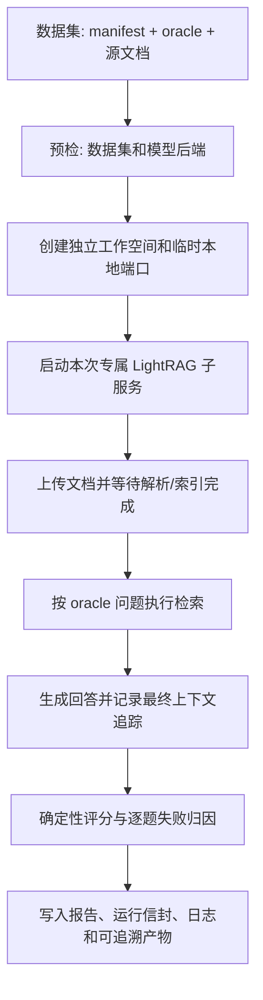

# LightRAG 产品测评框架

`memory_eval_tests` 是 LightRAG 的单一端到端产品测评框架。它使用带有标准答案和证据真值（oracle）的文档数据集，在每次运行中创建独立的 LightRAG 工作空间，依次完成文档导入、索引构建、检索、问答评分和失败归因。

它回答的是“当前 LightRAG 配置能否正确处理并回答这份受控文档”的产品问题。框架不提供研究型实验、参数臂组合、分支式测评或独立聚合报告脚本。

## 1. 测评目标与边界

| 层面 | 检查内容 | 主要输出 |
| --- | --- | --- |
| 文档入库 | 源文档是否成功上传、解析并完成索引 | `ingestion_receipt.json`、`index_receipt.json` |
| 检索 | oracle 所需证据是否命中、排名是否合理 | `average_recall`、`mrr`、`context_precision` |
| 问答 | 回答是否正确、有最终上下文支撑、能否正确拒答 | `answer_accuracy`、`groundedness`、`abstention_accuracy` |
| 可诊断性 | 错误属于检索、上下文选择/截断、生成还是拒答 | `diagnosis.json`、`case_trace.json` |

它不用于通用知识评测、跨数据集排行榜或研究方法比较。每次运行只评估一个固定产品链路，以保证不同运行的结果可追溯、可复现。

## 2. 目录与数据契约

```text
memory_data_service/                 # 生成/管理带 oracle 的数据集
  generated/<dataset_id>/
    manifest.json                    # 数据集和源文档清单
    oracle.json                      # 问题、答案和所需证据

memory_eval_tests/                   # 本框架
  workflow.py                        # 唯一的端到端流程定义
  cli.py                             # 单次测评入口
  runner.py                          # 可选进程看护入口
  execution.py                       # 独立 LightRAG 运行单元
  ingestion.py                       # 上传与入库确认
  retrieval.py                       # 检索评分
  answer.py                          # 回答评分
  diagnosis.py                       # 逐题失败归因
  artifacts.py                       # 运行信封、进度与事件
  runs/<run_id>/                     # 每次运行的全部产物
```

`--dataset` 指向的数据集至少需要：

- `manifest.json`：数据集 ID 与标记为 `created` 的 DOCX/PDF 源文档；
- `oracle.json`：问题、期望答案、`expected_behavior` 和 `evidence_fact_ids`；
- 清单中声明的实际源文档。

框架只上传源文档；oracle、截图、JSON 与旧运行产物不会入库。清单不可读、没有源文档或文件缺失时，会在模型调用前失败。

## 3. 执行流程



1. **预检**：读取源文档，并检查默认 Ollama 后端可达，或远程模型凭据已配置；不会为预检调用付费模型。
2. **隔离执行单元**：在 `<run>/isolated/` 创建新的存储、输入目录、工作空间和回环端口，然后启动专属 LightRAG 子进程。它不会复用主服务或其他运行的索引。
3. **导入与索引**：上传清单中的源文档并等待处理完成。默认要求所有文档成功。
4. **检索评分**：对非拒答题调用 `/query/data`，将 oracle 证据与有序 chunk 对齐，计算证据召回、MRR 和上下文精确率。
5. **回答评分**：对全部题目调用 `/query`，记录最终上下文追踪，检查答案、数值/单位、公式、表格单元、引用和拒答。
6. **归因与收尾**：合并逐题结果，输出失败原因和报告，并停止本次专属子服务。默认保留隔离存储以便复核。

## 4. 前置条件

在仓库根目录执行：

```bash
cd /Users/sakura/RAG/LightRAG
conda env create -f memory_eval_env.yml
```

默认配置使用本机 Ollama。请确保回答模型与 embedding 模型已经安装、服务可访问：

```bash
ollama serve
ollama pull qwen3:8b
ollama pull bge-m3:latest
```

也支持已经配置凭据的 OpenAI、Azure OpenAI、Gemini 或 Bedrock。框架会读取常规 LightRAG 配置中的 `LLM_BINDING`、`LLM_MODEL`、`EMBEDDING_BINDING`、`EMBEDDING_MODEL` 及对应凭据。

| 变量 | 用途 |
| --- | --- |
| `MEMORY_EVAL_DATASETS_ROOT` | 数据集根目录；wheel 安装时尤其需要 |
| `MEMORY_EVAL_RUNS_ROOT` | 运行产物根目录；WebUI 与 CLI 必须保持一致 |
| `LLM_BINDING` / `LLM_MODEL` / `LLM_BINDING_HOST` | 回答与抽取模型提供方、模型名和服务地址 |
| `EMBEDDING_BINDING` / `EMBEDDING_MODEL` / `EMBEDDING_BINDING_HOST` | 向量模型提供方、模型名和服务地址 |
| `LIGHTRAG_API_KEY` / `LIGHTRAG_ACCESS_TOKEN` | 部署要求认证时使用；不会明文写入产物 |

## 5. 快速开始（CLI）

### 5.1 生成数据集

```bash
conda run -n lightrag-memory-eval python -m memory_data_service.cli generate \
  --profile rich \
  --tier smoke \
  --formats docx \
  --dataset-id rich-smoke-v1
```

数据集默认写入 `memory_data_service/generated/rich-smoke-v1/`。已有完整数据集可跳过此步。

### 5.2 运行完整测评

```bash
DATASET=memory_data_service/generated/rich-smoke-v1
RUN=memory_eval_tests/runs/evaluation-$(date +%Y%m%d-%H%M%S)

conda run -n lightrag-memory-eval python -m memory_eval_tests.cli \
  --dataset "$DATASET" \
  --output-dir "$RUN" \
  --label "rich smoke 基线" \
  --mode mix \
  --top-k 5 \
  --chunk-top-k 5
```

运行中可观察：

```bash
cat "$RUN/progress.json"
tail -f "$RUN/run.log"
```

运行结束后优先查看：

```bash
cat "$RUN/report.md"
cat "$RUN/diagnosis.json"
```

### 5.3 参数说明

| 参数 | 默认值 | 说明 |
| --- | --- | --- |
| `--model` | `qwen3:8b` | 本次运行的回答模型 |
| `--mode` | `mix` | LightRAG 查询模式 |
| `--top-k` | `5` | 检索候选数量 |
| `--chunk-top-k` | `5` | 返回的 chunk 数量 |
| `--num-ctx` | `16384` | 回答模型上下文窗口 |
| `--num-predict` | `4096` | 回答最大输出；KG 抽取使用独立保护预算 |
| `--max-total-tokens` | `8192` | 回答查询允许的最大上下文 token |
| `--temperature` | `0` | 回答温度；基线建议保持 0 |
| `--engine` | `native` | 文档解析引擎 |
| `--max-cases` | `0` | 最大测题数；`0` 表示全部，正数时做确定性均匀抽样 |
| `--skip-kg` | 关闭 | 跳过 KG 抽取并使用 `naive` 向量检索；若同时指定 `--mode`，只能为 `naive` |
| `--runs-root` | `memory_eval_tests/runs` | WebUI 扫描与索引失效所使用的运行根目录 |

导入成功门槛默认是 **100%**。只有在明确接受部分文档失败时才设置：

```bash
--extra allow_partial_ingestion=true \
--extra ingestion_success_threshold=0.95
```

该决定与阈值会写入 `run.json`，不应作为常规基线配置。

### 5.4 长时间运行（可选）

`memory_eval_tests.runner` 是进程级看护入口。它在子进程崩溃时重启一个新的隔离运行单元；默认 WebUI 不启用自动重启。

```bash
conda run -n lightrag-memory-eval python -m memory_eval_tests.runner \
  --dataset "$DATASET" \
  --output-dir "$RUN" \
  --max-restarts 1 \
  --supervision heartbeat
```

只有需要终止长期无活动的挂起进程时才使用 `heartbeat`，短暂模型停顿不应被误判为故障。

## 6. WebUI 使用方式

启动 LightRAG API 后，在 WebUI 打开“测评”页面：

1. 在“数据集”中选择已有数据集，或创建数据集任务；
2. 在“运行测评”中填写名称、模型、检索模式、Top-K、上下文与 KG 选项；
3. 提交后自动返回“测评”列表；排队中的任务会立即出现，并在开始后持续刷新进度。作业页面仅用于查看队列和取消任务；
4. 完成后查看结果摘要、逐题详情、报告、日志、导入回执和失败归因；
5. 仅在不再需要复核时删除运行；删除会同时清除该运行的隔离索引和记录。

WebUI 和 CLI 使用相同的 `memory_eval_tests.cli` 入口及运行信封，因此两者结果可以并列查看。

## 7. 运行产物

每次运行位于 `memory_eval_tests/runs/<run_id>/`：

| 文件/目录 | 内容与用途 |
| --- | --- |
| `run.json` | 主信封：状态、参数、环境快照、数据集指纹、指标、失败信息和产物索引 |
| `progress.json` | 当前阶段、完成数和提示信息，适合轮询 |
| `events.jsonl` | 结构化生命周期事件与错误偏移量 |
| `run.log` | CLI 标准输出与异常日志 |
| `report.md` | 正确题数、回答准确率、证据支撑率和失败归因摘要 |
| `ingestion_receipt.json` | 每个源文档的上传、处理状态、内容哈希和失败原因 |
| `index_receipt.json` | 工作空间、存储 ID 和索引完成信息 |
| `case_trace.json` | 每道题的 oracle、检索结果、回答和最终上下文追踪 |
| `diagnosis.json` | 可归因覆盖率、原因分布和逐题诊断 |
| `execution_unit.json` | 子服务端口、工作空间、配置指纹、生命周期和保留策略 |
| `execution_unit.log` | 本次专属 LightRAG 子服务日志 |
| `isolated/` | 本次运行的独立输入与索引存储 |

`run.json`、`progress.json`、作业文件和 WebUI 扫描索引均采用“先写临时文件、再原子替换”的方式发布，因此读取端不会看到截断 JSON。参数、数据集哈希、代码版本和实际运行环境会被记录；token、API key 与形似凭据的 `--extra` 值会被脱敏。

## 8. 指标解读

### 检索

- **证据召回@K（`average_recall`）**：oracle 所需事实被检索到的比例；低值通常意味着解析、索引或检索问题。
- **MRR（`mrr`）**：首个所需证据的排名倒数；越接近 1，关键证据越靠前。
- **上下文精确率（`context_precision`）**：命中证据的 chunk 占候选 chunk 的比例；低值提示上下文噪声较大。

### 回答

- **回答准确率（`answer_accuracy`）**：排除待复核题后，答案符合 oracle 的比例。
- **证据支撑率（`groundedness`）**：最终送入模型的上下文中是否包含所需 oracle 证据；它不等于候选 references 中是否出现过证据。
- **拒答准确率（`abstention_accuracy`）**：没有可靠证据时能否正确拒答。
- **数值/单位、公式、表格单元准确率**：结构化答案的专门检查。
- **最终上下文可观测率**：最终上下文追踪能否取得。不可观测时，系统不会把候选检索结果错误当作模型可见证据。

解读指标时必须同时查看数据集、模型、Top-K、解析引擎和 KG 设置；这些条件记录在 `run.json` 的 `execution_manifest` 与 `runtime_snapshot` 中。

## 9. 常见问题与排障

| 现象 | 优先检查 |
| --- | --- |
| 预检提示 Ollama 不可达 | `ollama serve` 是否运行；`LLM_BINDING_HOST` 与 `EMBEDDING_BINDING_HOST` 是否正确；模型是否安装 |
| 导入阶段失败 | `ingestion_receipt.json` 中每个文档状态；`execution_unit.log`；文件是否仍与清单一致 |
| 子服务无法健康检查 | `execution_unit.log`、模型/embedding 配置、端口占用和本机资源 |
| 检索召回低 | `case_trace.json` 中的 `expected_fact_ids`、`hit_fact_ids`、`top_contexts`；再检查解析和 Top-K |
| 回答低而检索正常 | 查看逐题最终上下文、回答与 `diagnosis.json`；常见原因是上下文选择/截断或生成失败 |
| 状态长期不变 | 检查 `progress.json` 的 phase、`run.log` 与 `execution_unit.log`；必要时在 WebUI 取消作业 |
| WebUI 看不到 CLI 运行 | CLI 的 `--runs-root` 或 `MEMORY_EVAL_RUNS_ROOT` 必须与 API 服务使用的根目录相同 |

## 10. 开发验证

最小产品回归测试：

```bash
/Users/sakura/miniconda3/envs/lightrag-memory-eval/bin/python3.11 -m pytest -q \
  tests/memory_eval/test_product_evaluation.py \
  tests/api/routes/test_eval_jobs.py \
  tests/api/routes/test_eval_routes.py
```

这些测试覆盖单一运行信封、原子 JSON 发布、产品 CLI 命令构造，以及 API 对已移除字段和基础设施参数的拒绝。
